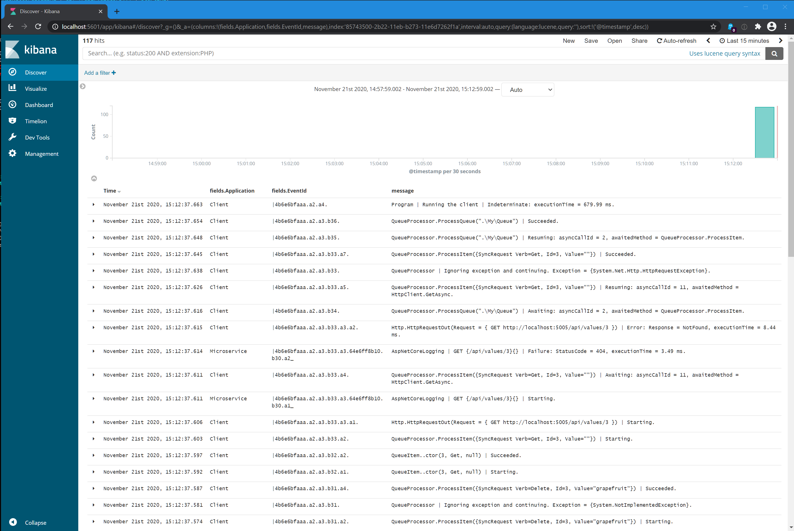

# PostSharp Logging, Serilog and the Elastic Stack

## Table of contents

- [Introduction](#introduction)
- [What you will end up with](#what-you-will-end-up-with)
- [Requirements](#requirements)
- [Usage on Windows](#usage-on-windows)
- [Usage on Linux](#usage-on-linux)
- [Credit](#credit)

---

## Credits

This example is forked from https://github.com/FantasticFiasco/serilog-sinks-http-sample-elastic-stack. 
All credits for integrating Elastic Stack with Serilog go to the original authors.

The `elastic-stack` directory is a clone of [docker-elk](https://github.com/deviantony/docker-elk) with minor modifications done by FantasticFiasco. 
Credit to [deviantony](https://github.com/deviantony) for publishing the Elastic Stack boilerplate.

## Introduction

This example shows how to combine PostSharp Logging, Serilog and the Elastic Stack to achieve logging of a distributed application:

* [Elastic Stack](https://www.elastic.co/products) is fantastic at collecting and visualizing log events. 
* [Serilog](https://serilog.net/) is fantastic at producing structured log events.  
* [PostSharp Logging](https://www.postsharp.net/logging) is fantastic at instrumenting your project and feeding Serilog with plently structured log events.

This repository provides a sandbox where developers can explore the life of a log event starting with its birth in PostSharp and Serilog, 
its transport over the network to Logstash, its fields being indexed by Elasticsearch and finally its legacy being recorded as a historical event in Kibana.

This example contains two applications that run together, so we can explore the correlation of requests coming from both apps.

PostSharp Logging and Serilog are initialized in both applications in `Program.Main`.

Correlation is implemented by two artifacts:

* On client-side, a call to `HttpClientLogging.Initialize()`, which intercepts calls to `HttpClient` (outgoing HTTP requests) and adds correlation headers.

* On server-side, a call to `AspNetCoreLogging.Initialize()`, which intercepts incoming HTTP requests and interprets the correlation headers.

If you have an application that acts both as an HTTP client and server, you would need both calls.


## What you will end up with



* Automatic logging without boilerplate: your code is completely instrumented and you don't by a just a couple of custom attributes.

* EventId: a synthetic id, cross-process identifier that makes easy to get all traces of a single distributed transaction just by using
the `StartsWith` operator. For instance, in Kibana, try a filter like `fields.EventId: '4b6e6bfaaa.a2.a3.b33.a7*'`.

* User: a baggage property, defined in the client and transported to the server. Try to display `fields.#User`.


You are now ready to take it to the next level. 

If you fancy the producing part you'll dig deeper into PostSharp Logging options, custom logging features, and message formatters. 
If you enjoy monitoring applications in production you'll explore Kibana with its visualizations and dashboards.

## Requirements

- [Docker](https://www.docker.com/community-edition#/download)
- [Docker Compose](https://docs.docker.com/compose/install)

## Usage on Windows

### Bringing up Elastic Stack

Start the stack using `docker-compose`:

```posh
PS> cd .\elastic-stack\
PS> docker-compose up
```

If this is the first time the stack is started, you'll have to create a Logstash index pattern. 
Give the stack some time to initialize, then create the index manually in the UI, or run the following commands in PowerShell:

```posh
PS> $Headers = New-Object "System.Collections.Generic.Dictionary[[String],[String]]"
PS> $Headers.Add("Content-Type", "application/json")
PS> $Headers.Add("kbn-version", "6.2.3")
PS> Invoke-RestMethod "http://localhost:5601/api/saved_objects/index-pattern" `
      -Method Post `
      -Headers $Headers `
      -Body '{"attributes":{"title":"logstash-*","timeFieldName":"@timestamp"}}'
```

### Publishing log events using PostSharp Logging

This runs the web service:

```posh
PS> cd .\MicroserviceSample\
PS> dotnet run
```

And this runs the console app:

```posh
PS> cd .\ClientSample\
PS> dotnet run
```

### Using Kibana to render the log events

Access the Kibana web UI by hitting [http://localhost:5601](http://localhost:5601) with a web browser.

## Usage on Linux

### Bringing up Elastic Stack

Start the stack using `docker-compose`:

```bash
$ cd elastic-stack/
$ docker-compose up
```

If this is the first time the stack is started, you'll have to create a Logstash index pattern. Give the stack some time to initialize and then run the following commands:

```bash
$ curl -XPOST -D- 'http://localhost:5601/api/saved_objects/index-pattern' \
    -H 'Content-Type: application/json' \
    -H 'kbn-version: 6.2.3' \
    -d '{"attributes":{"title":"logstash-*","timeFieldName":"@timestamp"}}'
```

### Publishing log events using Serilog

```bash
$ cd MicroserviceSample/
$ dotnet run
```

And this runs the console app:

```bash
$ cd ClientSample/
$ dotnet run
```

### Using Kibana to render the log events

Access the Kibana web UI by hitting [http://localhost:5601](http://localhost:5601) with a web browser.

